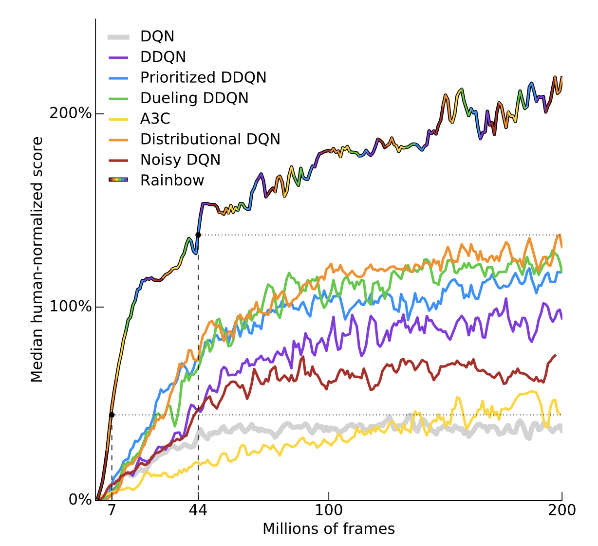
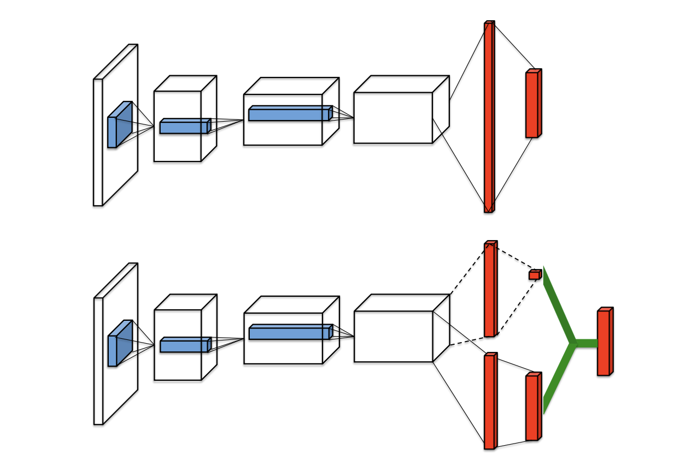

# Rainbow

## 1. Raibowの全体像



> Rainbow（図中虹色）はDQNに6つの手法を組み合わせて当時のSoTAを達成（[[Hessel, M. 18]](https://arxiv.org/abs/1710.02298) Figure.1）

RaibowはDeep Q-Network、通称DQNをベースとしたモデルです。Rainbowでは、DQNに6つの手法を組み合わせることで、強化学習のタスクで当時の最高性能（SoTA）を達成しました。本記事では、DQNについて簡単に説明した後、Rainbowで用いられている手法について説明します。

* DQN
* 6つの手法
    * Double DQN
    * 優先度付き経験バッファ
    * Dueling Network
    * Noisy Network
    * Categorical Network
    * Multi-step Learning

また、本記事で取り扱うタスクは、以下のCartPoleです。


> Cart-Pole （[Building a DQN in PyTorch: Balancing Cart Pole with Deep RL](https://blog.gofynd.com/building-a-deep-q-network-in-pytorch-fa1086aa5435)より引用）

この記事では、Rainbow[[Hessel, M. 18]](https://arxiv.org/abs/1710.02298)について解説していきます。タスクは、上の図にあるようなCart-poleを取り扱います。**Cart-poleでは、棒の乗った台車を左右に揺らすことで棒をなるべく長い時間立たせることが目的**になります。状態（State）は、カート位置・カートの速度・棒の角度・棒の角速度の4つです。行動（Action）は、台車を左に動かす・右に動かすの2つだけです。棒が立っていれば、即時報酬（Reward）として1が与えられます。


## 2. DQN

* ニューラルネットによるQ学習
* 経験バッファ（Experience Buffer）
* ターゲットネットワーク
* 勾配クリッピング


### 2.1 ニューラルネットによるQ学習


> DQN （[Building a DQN in PyTorch: Balancing Cart Pole with Deep RL](https://blog.gofynd.com/building-a-deep-q-network-in-pytorch-fa1086aa5435)より引用）

ニューラルネットによるQ学習では、行動価値と呼ばれるQ値をニューラルネットに予測させます。ニューラルネットへの入力状態、出力は各行動に対する行動価値となります。時刻$t$のニューラルネットのパラメータを$\theta_t$とすると、$Q(s_t,a_t;\theta_t)$がニューラルネットの出力となります。これのターゲットは1つ時刻を進めたときの行動価値$r_t+\gamma \max_{a'} Q(s_{t+1}, a';\theta_t)$になります。このターゲットは**TDターゲット**（TD: Temporal Difference）と呼ばれます。このTDターゲットは、$Q(s_t,a_t;\theta_t)$の時刻を既知の$r_t$を使って1つ展開したものになります。ニューラルネットの学習に用いる誤差は、とTDターゲットの二乗誤差であり、以下の式となります。この誤差は**TD誤差**と呼ばれます。

$$
L(\theta_t) = \mathbb{E}_{(s_t,a_t,r_t,s_{t+1})} \big[ \big( r_t + \gamma \max_{a'} Q(s_{t+1},a';\theta_t) - Q(s_t, a_t; \theta_t) \big)^2 \big]
$$

### 2.2 経験再生（Experience Replay）

DQNをそのままミニバッチで学習させようとすると、ミニバッチ内の遷移同士がかなり相関し合っています（例えば、ミニバッチ内に連続した遷移があると相関が強そうなことがわかります）。この「ミニバッチ内の相関」を消すために導入されたものが経験バッファです。

仕組みは非常に単純です。ミニバッチのサイズを32とします。経験バッファには、遷移を例えば1,000個ほど先に貯めておきます。**DQNの学習時は経験バッファから32個の遷移をランダムにサンプリングすることで、遷移同士の相関を持たないミニバッチ**を作れます。あとは、前述した損失関数に従ってニューラルネットを学習させるだけです。

### 2.3 ターゲットネットワーク

TDターゲットは$r_t+\gamma \max_{a'} Q(s_{t+1}, a';\theta_t)$で表せました。このTDターゲットにはある問題があります。それは、TDターゲットの中に、更新対象である$Q(s_{t+1}, a';\theta_t)$が含まれていることです。これにより$Q(\theta_t)$が更新されるごとにターゲットも大きく変化してしまい、学習が安定しません。そのため、更新対象のニューラルネットワーク$Q(\theta_t)$とは別に、ターゲットネットワーク$Q(\theta^-)$を用意します。この**ターゲットネットワークの正体は、任意のステップの間だけ重みを固定した**$Q(\theta)$ になります。例えば任意のステップを100とすると、ターゲットネットワークは100ステップごとに更新対象の$Q(\theta)$の重みと同期される、ということです。ターゲットネットワークを用いたTDターゲットは$r_t+\gamma \max_{a'} Q(s_{t+1}, a';\theta^-)$となり、TD誤差は次の式になります。前述の誤差関数との違いは、TDターゲットの$\theta$が$\theta^-$になっている点のみです。

$$
L(\theta_t) = \mathbb{E}_{(s_t,a_t,r_t,s_{t+1})} \big[ \big( r_t + \gamma \max_{a'} Q(s_{t+1},a';\theta^-) - Q(s_t, a_t; \theta) \big)^2 \big]
$$

### 2.4 勾配クリッピング

最後に勾配クリッピングです。こちらは単に勾配を$(-1, 1)$の範囲にクリッピングすることで学習が安定した、というものです。実装では、Huber loss（`F.smooth_l1_loss`)を用いることで、勾配クリッピングを実現しています。

## 3. Rainbow: 6つの手法

* Double DQN
* 優先度付き経験再生
* Dueling Network
* Noisy Network
* Categorical Network
* Multi-step Learning

### 3.1 Double DQN

Double DQN[[Hasselt, H. 16]](https://arxiv.org/abs/1509.06461)では、TDターゲットの取り方にさらに工夫を加えます。DQNでのTDターゲットは、ターゲットネットワーク$Q(\theta^-)$を用いて以下の式で表せました。

$$
 r_t + \gamma \max_{a'} Q(s_{t+1},a';\theta^-)
$$

この式で、第2項の行動$a'$はターゲットネットワーク$Q(\theta^-)$によって決定します。**Double DQNでは、TDターゲットの行動$a'$は更新対象である**$Q(\theta)$、**TDターゲットの値はターゲットネットワーク**$Q(\theta^-)$を用いるようにしています。つまり、Double DQNのTDターゲットは以下の式となります。

$$
 r_t + \gamma  Q(s_{t+1}, \argmax_{a'} Q(s_{t+1},a';\theta);\theta^-)
$$


### 3.2 優先度付き経験再生

経験再生では、バッファ内の各経験が一様分布によってランダムにサンプリングされることで、ミニバッチが作られていました。ただ、経験によって学び甲斐があるものとそうでないものがあるはずです。学習時には、学び甲斐がある経験を優先的にサンプリングし、DQNのDQNのより良い学習を促したいです。この考えを実現させたものが、**優先度付き経験バッファ**（Prioritized Experience-Replay Buffer）[[Schaul, T. 15]](https://arxiv.org/abs/1511.05952)です。

優先度付き経験再生では、「**TD誤差が大きいものこそ学び甲斐がある**」とし、各経験にTD誤差に基づいた優先度をつけてバッファへ保存します。ニューラルネットの学習時には、この優先度に基づいて経験をサンプリングし、ミニバッチを作ります。

### 3.3 Dueling Network

Dueling Network[[Wang, Z. 15]](https://arxiv.org/abs/1511.06581)ではあらたに**アドバンテージ**（Advantage）、というのを導入します。アドバンテージは、行動価値から状態価値を引いた値になります。つまり、以下のように定義されます。

$$
A(s,a) = Q(s, a) - V(s)
$$

行動価値は、ある状態である行動をとったときに得られるであろう収益を表しています。状態価値は、その状態自体で得られるであろう収益を表してくれています。アドバンテージは、行動価値から状態価値を引いた値なので、**ある行動がその状態において良いものなのか悪いものなのかを示してくれていること**がわかります。上の式で$Q=$の形に直します。

$$
Q(s, a) = V(s) + A(s,a) 
$$

Q値は、状態価値とアドバンテージの和としてあらわせるので、ニューラルネットワークの形もこれに合わせて変更します。



> 通常のDQN（上）とDueling Network（下）（[[Wang, Z. 15]](https://arxiv.org/abs/1511.06581) Figure.1）

上の図において、図中上が通常のDQN、図中下がDueling Networkになります。DQNでは単にQ値を出していました。一方、**Dueling Networkでは2股に分けてからそれらの出力を足し算する形でQ値**を出しています。2股のうち上が状態価値（スカラー）、下がアドバンテージ（ベクトル）になり、緑色の線がこれらの和を表しています。最終的な出力はQ値になっているので、損失関数などはDQNから変更なくそのまま使えます。

### 3.4 Noisy Network

DQNでは、探索では$\varepsilon$-greedyを用いて経験を貯めていました。ただ、ハイパーパラメータである$\varepsilon$を適切な値に設定するのは難しいです。そこで、Noisy Network[[Fortunato, M. 18]](https://arxiv.org/abs/1706.10295)は、**線形層の重みとバイアスにノイズを加えることでランダム性を持たせ、$\varepsilon$-greedyの必要性を排除**しています。

通常の線形層は以下の式でかけます。

$$
y = wx + b
$$

ここで$x \in \mathbb{R}^p$は入力、 $w \in \mathbb{R}^{q \times p}$と$b \in \mathbb{R}^{q}$はそれぞれ重みとバイアスになります。一方、Noisy Networkの1層は以下の式になります。

$$
y = (\mu^w + \sigma^w \odot \epsilon^w) x + (\mu^b + \sigma^b \odot \epsilon^b)
$$

$w$と$b$がそれぞれ、$\mu^w + \sigma^w \odot \epsilon^w$ と $\mu^b + \sigma^b \odot \epsilon^b$ に置き換わっているだけです。$\mu,\sigma$が学習可能なパラメータになっており、$\epsilon$はノイズです。上の式からもわかるように、Noisy NetworkではVAEと同様、**Reparameterization Trickを用いて重みおよびバイアスにランダム性を持たせています**。

### 3.5 Categorical Network

...

### 3.6 Multi-step Learning

最後に、Multi-step Learning[[]]()です。こちらは非常に単純です。DQNでは、時刻を1ステップだけ展開した収益をTDターゲットとして用いていました。（$r_t, s_{t+1}$は既知）

$$
r_t + \gamma \max_{a'} Q(s_{t+1}, a';\theta^{-})
$$

これを例えば2ステップ先まで展開すると、以下の式になります。（$r_t, r_{t+1}, s_{t+2}$は既知）

$$
r_t + \gamma r_{t+1} + \gamma^2 \max_{a'} Q(s_{t+2}, a';\theta^{-})
$$

Multi-step Learningでは、**$N$ステップ先まで展開した収益をTDターゲットとする**だけです。Nステップ先の既知の収益は以下の式で表せます。

$$
R^{n}_t = \sum_{k=0}^{n-1} \gamma^{k} r_{t+k}.
$$

したがって、以下の損失関数でニューラルネットを学習させるのが、Multi-step Learningになります。

$$
\mathbb{E}\left[\left(R^{n}_t + \gamma^{n} \max_{a'} Q
(s_{t+n}, a';\theta^{-}) - Q(s_t, a_t;\theta)\right)^2\right]
$$


### 4. 実装

#### 説明手順
- 07. N-Step Learning
- 03. Prioritized Replay Buffer
- 05. Noisy Network
- 04. Dueling Network 
- 01. DQN
- 02. Double Q-Learning
- 06. Categorical DQN

#### PythonモジュールのInstallとImport
```
import sys
IN_COLAB = "google.colab" in sys.modules

if IN_COLAB:
    !apt install python-opengl
    !apt install ffmpeg
    !apt install xvfb
    !pip install PyVirtualDisplay==3.0
    # 今回強化学習で扱うゲームとしてCurt-Poleを選択していいます。OSSのOpenAI「Gym」を用います。
    !pip install gym==0.21.0
    from pyvirtualdisplay import Display
  
    # Start virtual display
    dis = Display(visible=0, size=(400, 400))
    dis.start()
    ! pip install pyglet==1.5.27 # Add this in addition to rainbow-is-all-you-need

import math
import os
import random
from collections import deque
# Dequeは
from typing import Deque, Dict, List, Tuple

import gym
import matplotlib.pyplot as plt
import numpy as np
import torch
import torch.nn as nn
import torch.nn.functional as F
import torch.optim as optim
from IPython.display import clear_output
from torch.nn.utils import clip_grad_norm_

# download segment tree module
# SumSegmentTreeは03. Prioritized Replay Bufferで利用。
# Segment Treeと言うデータ構造をざっくり知りたい方はこちら。
# - https://qiita.com/ageprocpp/items/f22040a57ad25d04d199
# - https://leetcode.com/articles/a-recursive-approach-to-segment-trees-range-sum-queries-lazy-propagation/
if IN_COLAB:
    !wget https://raw.githubusercontent.com/curt-park/rainbow-is-all-you-need/master/segment_tree.py
from segment_tree imporkt MinSegmentTree, SumSegmentTree
```

#### Replay Buffer と 07. N-Step Learning

```
class ReplayBuffer:
    """A simple numpy replay buffer."""

    def __init__(
        self, 
        obs_dim: int, 
        size: int, 
        batch_size: int = 32, 
        n_step: int = 1, 
        gamma: float = 0.99
    ):
        self.obs_buf = np.zeros([size, obs_dim], dtype=np.float32)
        self.next_obs_buf = np.zeros([size, obs_dim], dtype=np.float32)
        self.acts_buf = np.zeros([size], dtype=np.float32)
        self.rews_buf = np.zeros([size], dtype=np.float32)
        self.done_buf = np.zeros(size, dtype=np.float32)
        self.max_size, self.batch_size = size, batch_size
        self.ptr, self.size, = 0, 0
        
        # for N-step Learning
        # n_step_bufferと言うN個分のデータを貯めることができる貯蔵庫を用意する。
        self.n_step_buffer = deque(maxlen=n_step)
        self.n_step = n_step
        self.gamma = gamma

    ## Replay Buffer of DQN
    # def store(
    #     self,
    #     obs: np.ndarray,
    #     act: np.ndarray, 
    #     rew: float, 
    #     next_obs: np.ndarray, 
    #     done: bool,
    # ):
    #     self.obs_buf[self.ptr] = obs
    #     self.next_obs_buf[self.ptr] = next_obs
    #     self.acts_buf[self.ptr] = act
    #     self.rews_buf[self.ptr] = rew
    #     self.done_buf[self.ptr] = done
    #     # max_size(1000)に対して、1001個目のデータが入ってきた際には1個目のデータに上書きを行い、常に1000このデータを保有する。
    #     self.ptr = (self.ptr + 1) % self.max_size
    #     self.size = min(self.size + 1, self.max_size)

    ## Replay Buffer of N-Step Learning.
    def store(
        self, 
        obs: np.ndarray, 
        act: np.ndarray, 
        rew: float, 
        next_obs: np.ndarray, 
        done: bool,
    ) -> Tuple[np.ndarray, np.ndarray, float, np.ndarray, bool]:
        transition = (obs, act, rew, next_obs, done)
        # 貯蔵庫の末尾に1-frame分のデータを追加.
        self.n_step_buffer.append(transition)

        # single step transition is not ready
        # N個がBufferに貯まるまで、空のTupleを返す。
        if len(self.n_step_buffer) < self.n_step:
            return ()
        
        # make a n-step transition
        rew, next_obs, done = self._get_n_step_info(
            self.n_step_buffer, self.gamma
        )
        obs, act = self.n_step_buffer[0][:2]
        
        self.obs_buf[self.ptr] = obs
        self.next_obs_buf[self.ptr] = next_obs
        self.acts_buf[self.ptr] = act
        self.rews_buf[self.ptr] = rew
        self.done_buf[self.ptr] = done
        self.ptr = (self.ptr + 1) % self.max_size
        self.size = min(self.size + 1, self.max_size)
        
        return self.n_step_buffer[0]

    def sample_batch(self) -> Dict[str, np.ndarray]:
        idxs = np.random.choice(self.size, size=self.batch_size, replace=False)

        return dict(
            obs=self.obs_buf[idxs], # obs is abbreviation of observations.
            next_obs=self.next_obs_buf[idxs],
            acts=self.acts_buf[idxs], # acts is abbreviations of actions.
            rews=self.rews_buf[idxs], # rews is abbreviations of rewards.
            done=self.done_buf[idxs],
            # for N-step Learning
            indices=idxs,
        )
    
    def sample_batch_from_idxs(
        self, idxs: np.ndarray
    ) -> Dict[str, np.ndarray]:
        # for N-step Learning
        return dict(
            obs=self.obs_buf[idxs],
            next_obs=self.next_obs_buf[idxs],
            acts=self.acts_buf[idxs],
            rews=self.rews_buf[idxs],
            done=self.done_buf[idxs],
        )
    
    def _get_n_step_info(
        self, n_step_buffer: Deque, gamma: float
    ) -> Tuple[np.int64, np.ndarray, bool]:
        """Return n step rew, next_obs, and done."""
        # info of the last transition
        rew, next_obs, done = n_step_buffer[-1][-3:]

        for transition in reversed(list(n_step_buffer)[:-1]):
            r, n_o, d = transition[-3:]

            rew = r + gamma * rew * (1 - d)
            next_obs, done = (n_o, d) if d else (next_obs, done)

        return rew, next_obs, done

    def __len__(self) -> int:
        return self.size
```

#### 03. Prioritized Replay Buffer 

- 誤差(TD-Error)が大きいデータが繰り返し学習される現象を防ぐため、pure greedy prioritizationとuniform random samplingを組み合わせたStochastic samplingと言う手法を採用.
 
$$
P(i) = \frac{p_i^{\alpha}}{\sum_k p_k^{\alpha}}
$$

- DQNで導入されたRandom Samplingはデータ間の相関を減らすことができていた。しかし、Prioritized Replay BufferによりRandom Samplingでなくなったため、再度データ間の相関が発生。この問題は、以下のimportance-sampling (IS) weightsと言う重みを用いながらSamplingを行うことで解消を行う。

$$
w_i = \big( \frac{1}{N} \cdot \frac{1}{P(i)} \big)^\beta
$$

```
class PrioritizedReplayBuffer(ReplayBuffer):
    """Prioritized Replay buffer.
    
    Attributes:
        max_priority (float): max priority
        tree_ptr (int): next index of tree
        alpha (float): alpha parameter for prioritized replay buffer
        sum_tree (SumSegmentTree): sum tree for prior
        min_tree (MinSegmentTree): min tree for min prior to get max weight
        
    """
    
    def __init__(
        self, 
        obs_dim: int, 
        size: int, 
        batch_size: int = 32, 
        alpha: float = 0.6,
        n_step: int = 1, 
        gamma: float = 0.99,
    ):
        """Initialization."""
        assert alpha >= 0
        
        super(PrioritizedReplayBuffer, self).__init__(
            obs_dim, size, batch_size, n_step, gamma
        )
        self.max_priority, self.tree_ptr = 1.0, 0
        self.alpha = alpha
        
        # capacity must be positive and a power of 2.
        tree_capacity = 1
        while tree_capacity < self.max_size:
            tree_capacity *= 2

        self.sum_tree = SumSegmentTree(tree_capacity)
        self.min_tree = MinSegmentTree(tree_capacity)
        
    def store(
        self, 
        obs: np.ndarray, 
        act: int, 
        rew: float, 
        next_obs: np.ndarray, 
        done: bool,
    ) -> Tuple[np.ndarray, np.ndarray, float, np.ndarray, bool]:
        """Store experience and priority."""
        transition = super().store(obs, act, rew, next_obs, done)
        
        if transition:
            self.sum_tree[self.tree_ptr] = self.max_priority ** self.alpha
            self.min_tree[self.tree_ptr] = self.max_priority ** self.alpha
            self.tree_ptr = (self.tree_ptr + 1) % self.max_size
        
        return transition

    def sample_batch(self, beta: float = 0.4) -> Dict[str, np.ndarray]:
        """Sample a batch of experiences."""
        assert len(self) >= self.batch_size
        assert beta > 0
        
        indices = self._sample_proportional()
        
        obs = self.obs_buf[indices]
        next_obs = self.next_obs_buf[indices]
        acts = self.acts_buf[indices]
        rews = self.rews_buf[indices]
        done = self.done_buf[indices]
        weights = np.array([self._calculate_weight(i, beta) for i in indices])
        
        return dict(
            obs=obs,
            next_obs=next_obs,
            acts=acts,
            rews=rews,
            done=done,
            weights=weights,
            indices=indices,
        )
        
    def update_priorities(self, indices: List[int], priorities: np.ndarray):
        # 1フレームごとに行われるupdate_modelと言う関数の中で、Priorityの更新を行う。
        """Update priorities of sampled transitions."""
        assert len(indices) == len(priorities)

        for idx, priority in zip(indices, priorities):
            assert priority > 0
            assert 0 <= idx < len(self)

            self.sum_tree[idx] = priority ** self.alpha
            self.min_tree[idx] = priority ** self.alpha

            self.max_priority = max(self.max_priority, priority)
            
    def _sample_proportional(self) -> List[int]:
        """Sample indices based on proportions."""
        indices = []
        p_total = self.sum_tree.sum(0, len(self) - 1)
        segment = p_total / self.batch_size
        
        for i in range(self.batch_size):
            a = segment * i
            b = segment * (i + 1)
            upperbound = random.uniform(a, b)
            idx = self.sum_tree.retrieve(upperbound)
            indices.append(idx)
            
        return indices
    
    def _calculate_weight(self, idx: int, beta: float):
        """Calculate the weight of the experience at idx."""
        # get max weight
        p_min = self.min_tree.min() / self.sum_tree.sum()
        max_weight = (p_min * len(self)) ** (-beta)
        
        # calculate weights
        p_sample = self.sum_tree[idx] / self.sum_tree.sum()
        # importance-sampling (IS) weightsの計算を行う.
        weight = (p_sample * len(self)) ** (-beta)
        weight = weight / max_weight
        
        return weight
```


#### 05. Noisy Network


従来のDQNでは、一般的なNeural Networkを採用。

$$
y = wx + b,
$$
x
$x \in \mathbb{R}^p$ は入力でp次元のベクトル、$w \in \mathbb{R}^{q \times p}$は重みでq x p次元の行列、$b \in \mathbb{R}$はバイアスでq次元のベクトル。

しかし、NoisyNetworkでは、正規分布のノイズと学習可能なパラメタ muとsigmaを用いて、$w と $b を表現する。

$$
y = (\mu^w + \sigma^w \odot \epsilon^w) x + \mu^b + \sigma^b \odot \epsilon^b,
$$

```
F.linear(
            x,
            self.weight_mu + self.weight_sigma * self.weight_epsilon,
            self.bias_mu + self.bias_sigma * self.bias_epsilon,
        )
```

$\mu^w + \sigma^w \odot \epsilon^w$ が $w に対応し、
$\mu^b + \sigma^b \odot \epsilon^b$ replace $w$ が $b に対応する。

$\mu^w \in \mathbb{R}^{q \times p}, \mu^b \in \mathbb{R}^q, \sigma^w \in \mathbb{R}^{q \times p}$ and $\sigma^b \in \mathbb{R}^q$ は学習可能となっており、 $\epsilon^w \in \mathbb{R}^{q \times p}$ と $\epsilon^b \in \mathbb{R}^q$ は正規分布でノイズとなる。

学習可能とするために、nn.Parameterを使用する。
```
self.weight_mu = nn.Parameter(torch.Tensor(out_features, in_features))
self.weight_sigma = nn.Parameter(
    torch.Tensor(out_features, in_features)
)
```

1. **Independent Gaussian noise**: the noise applied to each weight and bias is independent, where each random noise entry is drawn from a unit Gaussian distribution. This means that for each noisy linear layer, there are $pq + q$ noise variables (for $p$ inputs to the layer and $q$ outputs).
2. **Factorised Gaussian noise:** This is a more computationally efficient way. It produces 2 random Gaussian noise vectors ($p, q$) and makes $pq + q$ noise entries by outer product as follows:

$$
\begin{align}
\epsilon_{i,j}^w &= f(\epsilon_i) f(\epsilon_j),\\
\epsilon_{j}^b &= f(\epsilon_i),\\
\text{where } f(x) &= sgn(x) \sqrt{|x|}.
\end{align}
$$

と言う2つの手法があるが、実験的に**Factorised Gaussian noise:**と言う手法が良いと分かったため、採用.

```
class NoisyLinear(nn.Module):
    """Noisy linear module for NoisyNet.
    
    
        
    Attributes:
        in_features (int): input size of linear module
        out_features (int): output size of linear module
        std_init (float): initial std value
        weight_mu (nn.Parameter): mean value weight parameter
        weight_sigma (nn.Parameter): std value weight parameter
        bias_mu (nn.Parameter): mean value bias parameter
        bias_sigma (nn.Parameter): std value bias parameter
        
    """

    def __init__(
        self, 
        in_features: int, 
        out_features: int, 
        std_init: float = 0.5,
    ):
        """Initialization."""
        super(NoisyLinear, self).__init__()
        
        self.in_features = in_features
        self.out_features = out_features
        self.std_init = std_init

        self.weight_mu = nn.Parameter(torch.Tensor(out_features, in_features))
        self.weight_sigma = nn.Parameter(
            torch.Tensor(out_features, in_features)
        )
        self.register_buffer(
            "weight_epsilon", torch.Tensor(out_features, in_features)
        )

        self.bias_mu = nn.Parameter(torch.Tensor(out_features))
        self.bias_sigma = nn.Parameter(torch.Tensor(out_features))
        self.register_buffer("bias_epsilon", torch.Tensor(out_features))

        self.reset_parameters()
        self.reset_noise()

    def reset_parameters(self):
        """Reset trainable network parameters (factorized gaussian noise)."""
        mu_range = 1 / math.sqrt(self.in_features)
        self.weight_mu.data.uniform_(-mu_range, mu_range)
        self.weight_sigma.data.fill_(
            self.std_init / math.sqrt(self.in_features)
        )
        self.bias_mu.data.uniform_(-mu_range, mu_range)
        self.bias_sigma.data.fill_(
            self.std_init / math.sqrt(self.out_features)
        )

    def reset_noise(self):
        """Make new noise."""
        epsilon_in = self.scale_noise(self.in_features)
        epsilon_out = self.scale_noise(self.out_features)

        # outer product
        self.weight_epsilon.copy_(epsilon_out.ger(epsilon_in))
        self.bias_epsilon.copy_(epsilon_out)

    def forward(self, x: torch.Tensor) -> torch.Tensor:
        """Forward method implementation.
        
        We don't use separate statements on train / eval mode.
        It doesn't show remarkable difference of performance.
        """
        # Noisy Networkの計算を行う.
        return F.linear(
            x,
            self.weight_mu + self.weight_sigma * self.weight_epsilon,
            self.bias_mu + self.bias_sigma * self.bias_epsilon,
        )
    
    @staticmethod
    def scale_noise(size: int) -> torch.Tensor:
        """Set scale to make noise (factorized gaussian noise)."""
        x = torch.randn(size)

        return x.sign().mul(x.abs().sqrt())
```

#### 04. Dueling Network

- 下記のようなアドバンテージ関数を、行動価値関数 - 状態価値関数という定義で作成する。


$$Q(s, a; \theta, \alpha, \beta) = V (s; \theta, \beta) + A(s, a; \theta, \alpha),$$

where $\theta$ denotes the parameters of the convolutional layers, while $\alpha$ and $\beta$ are the parameters of the two streams of fully-connected layers.

しかし、この状況だとある $Q$ に対して無数の $V$ と $A$ の候補が存在するため、以下のような制限を設ける。

$$
Q(s, a; \theta, \alpha, \beta) = V (s; \theta, \beta) + \big( A(s, a; \theta, \alpha) - \max_{a' \in |\mathcal{A}|} A(s, a'; \theta, \alpha) \big).
$$

より安定的に学習を行うために、Maxではなく平均を用いた手法が提案された。

$$
Q(s, a; \theta, \alpha, \beta) = V (s; \theta, \beta) + \big( A(s, a; \theta, \alpha) - \frac{1}{|\mathcal{A}|} \sum_{a'} A(s, a'; \theta, \alpha) \big).
$$

```
class Network(nn.Module):
    def __init__(
        self, 
        in_dim: int, 
        out_dim: int, 
        atom_size: int, 
        support: torch.Tensor
    ):
        """Initialization."""
        super(Network, self).__init__()
        
        self.support = support
        self.out_dim = out_dim
        self.atom_size = atom_size

        # set common feature layer
        self.feature_layer = nn.Sequential(
            nn.Linear(in_dim, 128), 
            nn.ReLU(),
        )
        
        # set advantage layer
        self.advantage_hidden_layer = NoisyLinear(128, 128)
        self.advantage_layer = NoisyLinear(128, out_dim * atom_size)

        # set value layer
        self.value_hidden_layer = NoisyLinear(128, 128)
        self.value_layer = NoisyLinear(128, atom_size)

    def forward(self, x: torch.Tensor) -> torch.Tensor:
        """Forward method implementation."""
        dist = self.dist(x)
        q = torch.sum(dist * self.support, dim=2)
        
        return q
    
    def dist(self, x: torch.Tensor) -> torch.Tensor:
        """Get distribution for atoms."""
        feature = self.feature_layer(x)
        adv_hid = F.relu(self.advantage_hidden_layer(feature))
        val_hid = F.relu(self.value_hidden_layer(feature))
        
        advantage = self.advantage_layer(adv_hid).view(
            -1, self.out_dim, self.atom_size
        )
        value = self.value_layer(val_hid).view(-1, 1, self.atom_size)
        q_atoms = value + advantage - advantage.mean(dim=1, keepdim=True)
        
        dist = F.softmax(q_atoms, dim=-1)
        dist = dist.clamp(min=1e-3)  # for avoiding nans
        
        return dist
    
    def reset_noise(self):
        """Reset all noisy layers."""
        self.advantage_hidden_layer.reset_noise()
        self.advantage_layer.reset_noise()
        self.value_hidden_layer.reset_noise()
        self.value_layer.reset_noise()
```

#### 02. Double Q-Learning
- _compute_dqn_loss()関数内で、targetを作成する際のQ値の求め方が異なる.

- DQN

```
target = reward + gamma * dqn_target(next_state).max(dim=1, keepdim=True)[0]
```
```
next_q_value = self.dqn_target( # Vanilla DQN
    next_state
).max(dim=1, keepdim=True)[0].detach()
```

- Double Q-Learning

```
selected_action = dqn(next_state).argmax(dim=1, keepdim=True)
target = reward + gamma * dqn_target(next_state).gather(1, selected_action)
```

```
next_q_value = self.dqn_target(next_state).gather(  # Double DQN
    1, self.dqn(next_state).argmax(dim=1, keepdim=True)
).detach()
```

```
class DQNAgent:
    """DQN Agent interacting with environment.
    
    Attribute:
        env (gym.Env): openAI Gym environment
        memory (PrioritizedReplayBuffer): replay memory to store transitions
        batch_size (int): batch size for sampling
        target_update (int): period for target model's hard update
        gamma (float): discount factor
        dqn (Network): model to train and select actions
        dqn_target (Network): target model to update
        optimizer (torch.optim): optimizer for training dqn
        transition (list): transition information including 
                           state, action, reward, next_state, done
        v_min (float): min value of support
        v_max (float): max value of support
        atom_size (int): the unit number of support
        support (torch.Tensor): support for categorical dqn
        use_n_step (bool): whether to use n_step memory
        n_step (int): step number to calculate n-step td error
        memory_n (ReplayBuffer): n-step replay buffer
    """

    def __init__(
        self, 
        env: gym.Env,
        memory_size: int,
        batch_size: int,
        target_update: int,
        gamma: float = 0.99,
        # PER parameters
        alpha: float = 0.2,
        beta: float = 0.6,
        prior_eps: float = 1e-6,
        # Categorical DQN parameters
        v_min: float = 0.0,
        v_max: float = 200.0,
        atom_size: int = 51,
        # N-step Learning
        n_step: int = 3,
    ):
        """Initialization.
        
        Args:
            env (gym.Env): openAI Gym environment
            memory_size (int): length of memory
            batch_size (int): batch size for sampling
            target_update (int): period for target model's hard update
            lr (float): learning rate
            gamma (float): discount factor
            alpha (float): determines how much prioritization is used
            beta (float): determines how much importance sampling is used
            prior_eps (float): guarantees every transition can be sampled
            v_min (float): min value of support
            v_max (float): max value of support
            atom_size (int): the unit number of support
            n_step (int): step number to calculate n-step td error
        """
        obs_dim = env.observation_space.shape[0]
        action_dim = env.action_space.n
        
        self.env = env
        self.batch_size = batch_size
        self.target_update = target_update
        self.gamma = gamma
        # NoisyNet: All attributes related to epsilon are removed
        
        # device: cpu / gpu
        self.device = torch.device(
            "cuda" if torch.cuda.is_available() else "cpu"
        )
        print(self.device)


        # 1-step learningとN-step learningを1対1でブレンドする。 
        # かつ1-step learningでは、03. Prioritized Replay Buffer (PER)と言う手法を採用する。
        # PER
        # memory for 1-step Learning
        self.beta = beta
        self.prior_eps = prior_eps
        self.memory = PrioritizedReplayBuffer(
            obs_dim, memory_size, batch_size, alpha=alpha
        )
        
        # memory for N-step Learning
        self.use_n_step = True if n_step > 1 else False
        if self.use_n_step:
            self.n_step = n_step
            self.memory_n = ReplayBuffer(
                obs_dim, memory_size, batch_size, n_step=n_step, gamma=gamma
            )
            
        # Categorical DQN parameters
        self.v_min = v_min
        self.v_max = v_max
        self.atom_size = atom_size
        self.support = torch.linspace(
            self.v_min, self.v_max, self.atom_size
        ).to(self.device)

        # networks: dqn, dqn_target
        self.dqn = Network(
            obs_dim, action_dim, self.atom_size, self.support
        ).to(self.device)
        self.dqn_target = Network(
            obs_dim, action_dim, self.atom_size, self.support
        ).to(self.device)
        self.dqn_target.load_state_dict(self.dqn.state_dict())
        self.dqn_target.eval()
        
        # optimizer
        self.optimizer = optim.Adam(self.dqn.parameters())

        # transition to store in memory
        self.transition = list()
        
        # mode: train / test
        self.is_test = False

    def select_action(self, state: np.ndarray) -> np.ndarray:
        """Select an action from the input state."""
        # NoisyNet: no epsilon greedy action selection
        selected_action = self.dqn(
            torch.FloatTensor(state).to(self.device)
        ).argmax()
        selected_action = selected_action.detach().cpu().numpy()
        
        if not self.is_test:
            self.transition = [state, selected_action]
        
        return selected_action

    def step(self, action: np.ndarray) -> Tuple[np.ndarray, np.float64, bool]:
        """Take an action and return the response of the env."""
        next_state, reward, done, _ = self.env.step(action)

        if not self.is_test:
            self.transition += [reward, next_state, done]
            
            # N-step transition
            if self.use_n_step:
                one_step_transition = self.memory_n.store(*self.transition)
            # 1-step transition
            else:
                one_step_transition = self.transition

            # add a single step transition
            if one_step_transition:
                self.memory.store(*one_step_transition)
    
        return next_state, reward, done

    def update_model(self) -> torch.Tensor:
        """Update the model by gradient descent."""
        # PER needs beta to calculate weights
        samples = self.memory.sample_batch(self.beta)
        weights = torch.FloatTensor(
            samples["weights"].reshape(-1, 1)
        ).to(self.device)
        indices = samples["indices"]
        
        # 1-step Learning loss
        elementwise_loss = self._compute_dqn_loss(samples, self.gamma)
        
        # PER: importance sampling before average
        loss = torch.mean(elementwise_loss * weights)
        
        # N-step Learning loss
        # we are gonna combine 1-step loss and n-step loss so as to
        # prevent high-variance. The original rainbow employs n-step loss only.
        if self.use_n_step:
            gamma = self.gamma ** self.n_step
            samples = self.memory_n.sample_batch_from_idxs(indices)
            elementwise_loss_n_loss = self._compute_dqn_loss(samples, gamma)
            elementwise_loss += elementwise_loss_n_loss
            
            # PER: importance sampling before average
            loss = torch.mean(elementwise_loss * weights)

        self.optimizer.zero_grad()
        loss.backward()
        clip_grad_norm_(self.dqn.parameters(), 10.0)
        self.optimizer.step()
        
        # PER: update priorities
        loss_for_prior = elementwise_loss.detach().cpu().numpy()
        new_priorities = loss_for_prior + self.prior_eps
        self.memory.update_priorities(indices, new_priorities)

        # 1ステップごとに、epsilon-greedyの役目を担うために、noiseを初期化して、exploration (探索)を行う。
        # NoisyNet: reset noise 
        self.dqn.reset_noise()
        self.dqn_target.reset_noise()

        return loss.item()
        
    def train(self, num_frames: int, plotting_interval: int = 200):
        """Train the agent."""
        self.is_test = False
        
        state = self.env.reset()
        update_cnt = 0
        losses = []
        scores = []
        score = 0

        for frame_idx in range(1, num_frames + 1):
            action = self.select_action(state)
            next_state, reward, done = self.step(action)

            state = next_state
            score += reward
            
            # NoisyNet: removed decrease of epsilon
            
            # PER: increase beta
            fraction = min(frame_idx / num_frames, 1.0)
            self.beta = self.beta + fraction * (1.0 - self.beta)

            # if episode ends
            if done:
                state = self.env.reset()
                scores.append(score)
                score = 0

            # if training is ready
            if len(self.memory) >= self.batch_size:
                loss = self.update_model()
                losses.append(loss)
                update_cnt += 1
                
                # if hard update is needed
                if update_cnt % self.target_update == 0:
                    self._target_hard_update()

            # plotting
            if frame_idx % plotting_interval == 0:
                self._plot(frame_idx, scores, losses)
                
        self.env.close()
                
    def test(self, video_folder: str) -> None:
        """Test the agent."""
        self.is_test = True
        
        # for recording a video
        naive_env = self.env
        self.env = gym.wrappers.RecordVideo(self.env, video_folder=video_folder)
        
        state = self.env.reset()
        done = False
        score = 0
        
        while not done:
            action = self.select_action(state)
            next_state, reward, done = self.step(action)

            state = next_state
            score += reward
        
        print("score: ", score)
        self.env.close()
        
        # reset
        self.env = naive_env

    def _compute_dqn_loss(self, samples: Dict[str, np.ndarray], gamma: float) -> torch.Tensor:
        """Return categorical dqn loss."""
        device = self.device  # for shortening the following lines
        state = torch.FloatTensor(samples["obs"]).to(device)
        next_state = torch.FloatTensor(samples["next_obs"]).to(device)
        action = torch.LongTensor(samples["acts"]).to(device)
        reward = torch.FloatTensor(samples["rews"].reshape(-1, 1)).to(device)
        done = torch.FloatTensor(samples["done"].reshape(-1, 1)).to(device)
        
        # Categorical DQN algorithm
        delta_z = float(self.v_max - self.v_min) / (self.atom_size - 1)

        with torch.no_grad():
            # Double DQN
            next_action = self.dqn(next_state).argmax(1)
            next_dist = self.dqn_target.dist(next_state)
            next_dist = next_dist[range(self.batch_size), next_action]

            t_z = reward + (1 - done) * gamma * self.support
            # 06. Categorical DQN
            t_z = t_z.clamp(min=self.v_min, max=self.v_max)
            b = (t_z - self.v_min) / delta_z
            l = b.floor().long()
            u = b.ceil().long()

            offset = (
                torch.linspace(
                    0, (self.batch_size - 1) * self.atom_size, self.batch_size
                ).long()
                .unsqueeze(1)
                .expand(self.batch_size, self.atom_size)
                .to(self.device)
            )

            proj_dist = torch.zeros(next_dist.size(), device=self.device)
            proj_dist.view(-1).index_add_(
                0, (l + offset).view(-1), (next_dist * (u.float() - b)).view(-1)
            )
            proj_dist.view(-1).index_add_(
                0, (u + offset).view(-1), (next_dist * (b - l.float())).view(-1)
            )

        dist = self.dqn.dist(state)
        log_p = torch.log(dist[range(self.batch_size), action])
        elementwise_loss = -(proj_dist * log_p).sum(1)

        return elementwise_loss

    def _target_hard_update(self):
        """Hard update: target <- local."""
        self.dqn_target.load_state_dict(self.dqn.state_dict())
                
    def _plot(
        self, 
        frame_idx: int, 
        scores: List[float], 
        losses: List[float],
    ):
        """Plot the training progresses."""
        clear_output(True)
        plt.figure(figsize=(20, 5))
        plt.subplot(131)
        plt.title('frame %s. score: %s' % (frame_idx, np.mean(scores[-10:])))
        plt.plot(scores)
        plt.subplot(132)
        plt.title('loss')
        plt.plot(losses)
        plt.show()
```

#### 学習

```
# environment
env_id = "CartPole-v0"
env = gym.make(env_id)
if IN_COLAB:
    env = gym.wrappers.Monitor(env, "videos", force=True)
seed = 777

def seed_torch(seed):
    torch.manual_seed(seed)
    if torch.backends.cudnn.enabled:
        torch.backends.cudnn.benchmark = False
        torch.backends.cudnn.deterministic = True

np.random.seed(seed)
random.seed(seed)
seed_torch(seed)
env.seed(seed)

# parameters
num_frames = 20000
memory_size = 10000
batch_size = 128
target_update = 100

# train
agent = DQNAgent(env, memory_size, batch_size, target_update)
agent.train(num_frames)
```

#### テストと可視化

```
video_folder="videos/rainbow"
agent.test(video_folder=video_folder)

import base64
import glob
import io
import os

from IPython.display import HTML, display


def ipython_show_video(path: str) -> None:
    """Show a video at `path` within IPython Notebook."""
    if not os.path.isfile(path):
        raise NameError("Cannot access: {}".format(path))

    video = io.open(path, "r+b").read()
    encoded = base64.b64encode(video)

    display(HTML(
        data="""
        <video width="320" height="240" alt="test" controls>
        <source src="data:video/mp4;base64,{0}" type="video/mp4"/>
        </video>
        """.format(encoded.decode("ascii"))
    ))


def show_latest_video(video_folder: str) -> str:
    """Show the most recently recorded video from video folder."""
    list_of_files = glob.glob(os.path.join(video_folder, "*.mp4"))
    latest_file = max(list_of_files, key=os.path.getctime)
    ipython_show_video(latest_file)
    return latest_file


latest_file = show_latest_video(video_folder=video_folder)
print("Played:", latest_file)
```

<video width="320" height="240" controls>
  <source src="assets/video/rainbow_cartpole.mp4" type="video/mp4">
</video>

# Follow-up reads
- [Rainbow is all you need](https://github.com/Curt-Park/rainbow-is-all-you-need)
